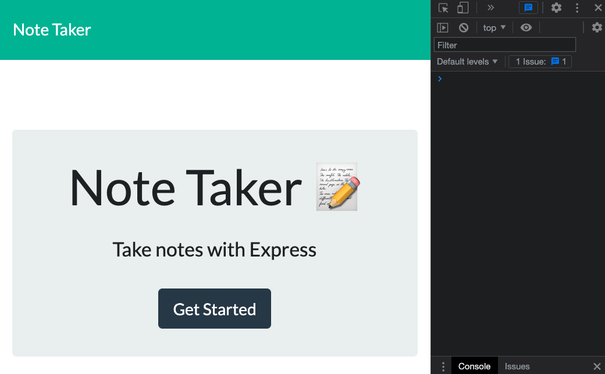
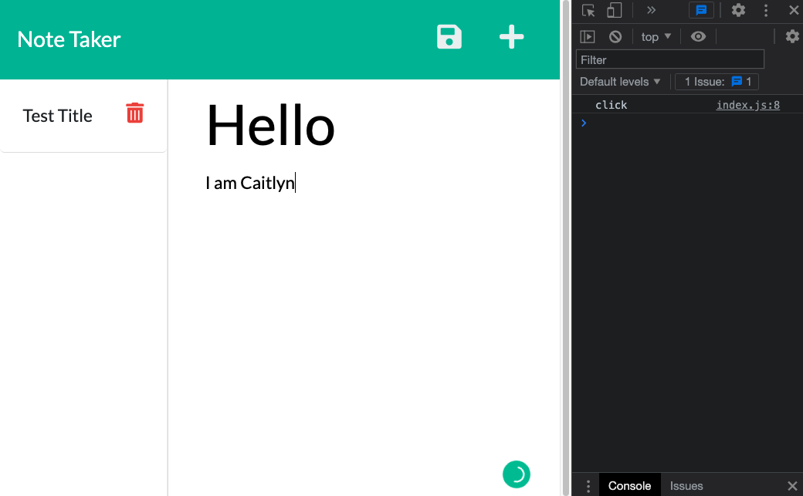
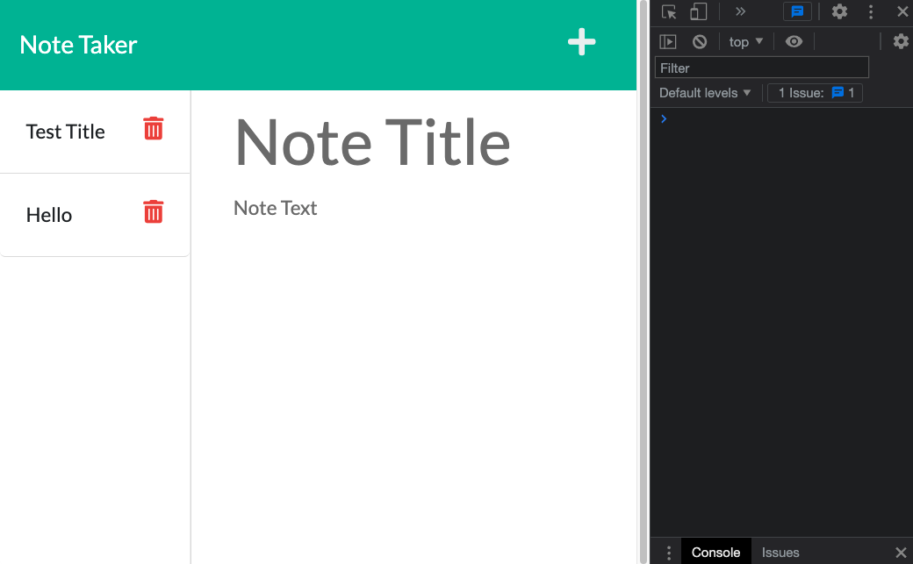
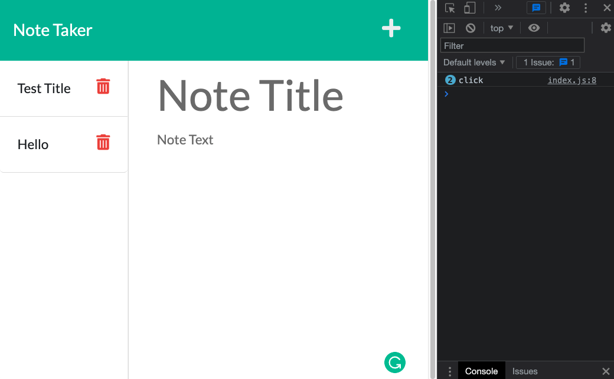

# note-taker

> If you are not willing to learn, no one can help you. If you are determined to learn, no one can stop you. -Zig Ziglar

## Description

I have modified start code to create an application that can be used to write and save notes. I have built the entire back end of this application using Express.js, which includes saving and retrieving note data from a JSON file. I then connected the front end to the back end and deployed it to Heroku.

---

## Important Links

- [Deployed URL](https://caitlyn-griffing.github.io/note-taker/)

- [GitHub URL](https://github.com/caitlyn-griffing/note-taker)

---

## Images of Deployed Web Page

---
