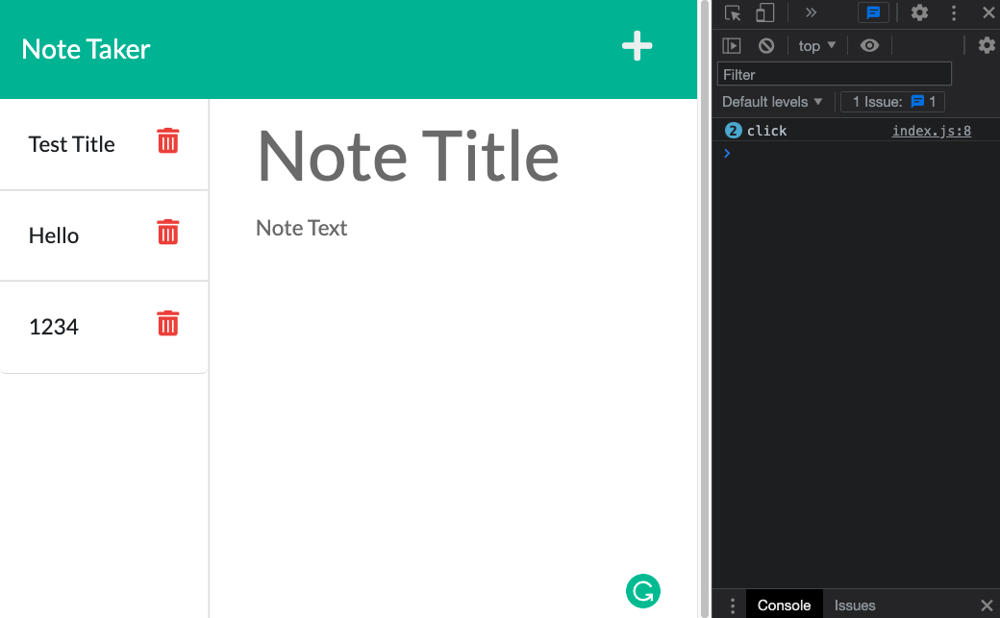

# note-taker

> If you are not willing to learn, no one can help you. If you are determined to learn, no one can stop you. -Zig Ziglar

## Description

I have modified start code to create an application that can be used to write and save notes. I have built the entire back end of this application using Express.js, which includes saving and retrieving note data from a JSON file. I then connected the front end to the back end and deployed it to Heroku.

---

## Table of Contents

- [Important Links](#important-links)
- [Usage](#usage)
- [Images](#images)
- [Frameworks](#frameworks)
- [License](#license)

## Important Links

- [Deployed Heroku URL](https://post-yo-note.herokuapp.com/)

- [GitHub URL](https://github.com/caitlyn-griffing/note-taker)

---

## Usage

- This application is invoked by running **npm start** in the command line
(localhost:3000).

---

## Images

---

## Frameworks

- [Node.js](https://nodejs.org/en/)
- [Express.js](https://expressjs.com/)

---

## License

  

